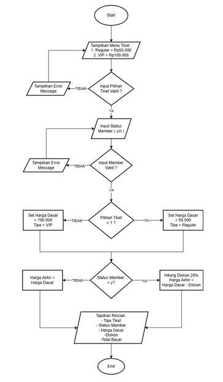
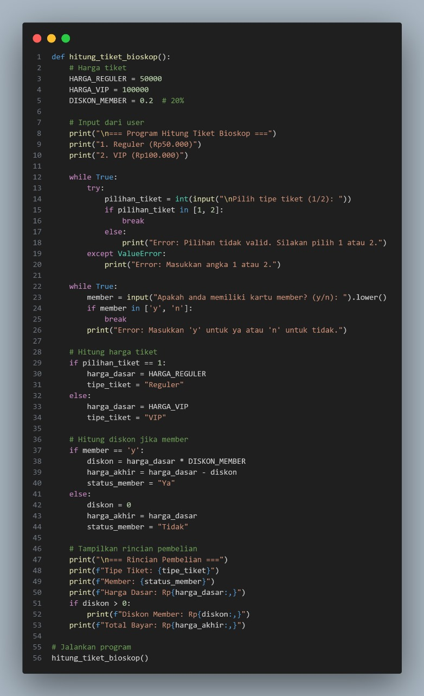
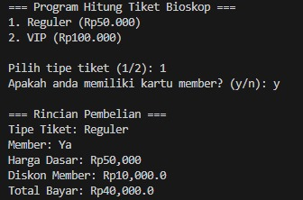
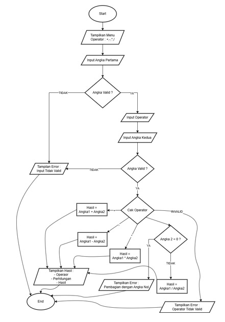
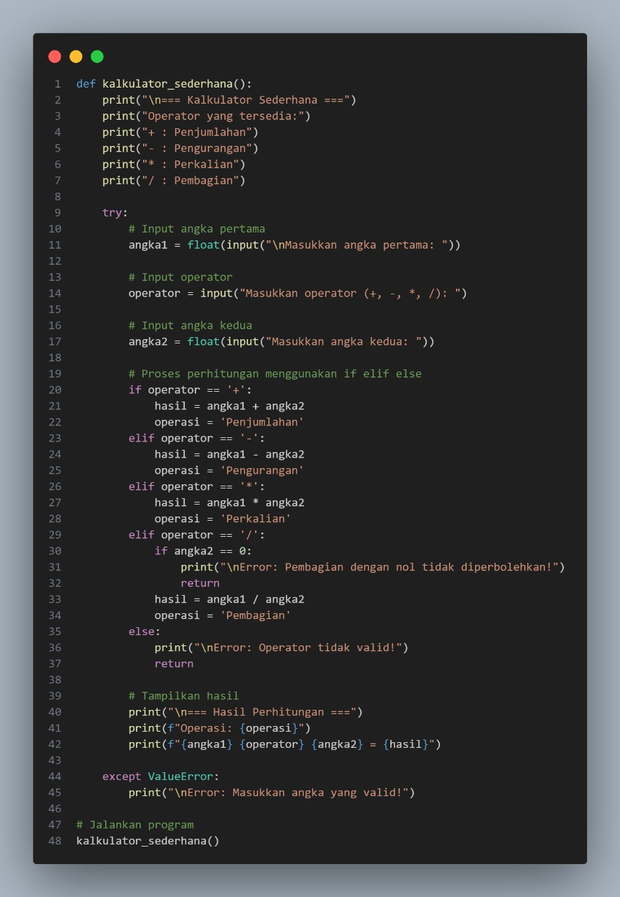
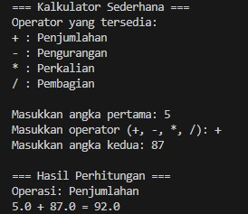

# Data Diri

Nama : She she metahanover

NIM : 312410432

Kelas : TI,24.A.3

# Menghitung Tiket Bioskop

## Flowchart

## Input Program

## Output Program

## Program ini memiliki fitur-fitur berikut:
1. Meminta input tipe tiket (Reguler/VIP)
2. Meminta status member (ya/tidak)
3. Menghitung harga dengan diskon jika user adalah member
4. Menampilkan rincian pembelian lengkap
5. Memiliki validasi input untuk menghindari error
6. Menggunakan format angka dengan pemisah ribuan untuk kemudahan membaca

## Cara menggunakan program:
1. Jalankan program
2. Pilih tipe tiket dengan memasukkan angka 1 (Reguler) atau 2 (VIP)
3. Masukkan status member dengan 'y' untuk ya atau 'n' untuk tidak
4. Program akan menampilkan rincian pembelian dan total yang harus dibayar

# Kalkulator Sederhana

## Flowchart

## Input Program

## Output Program

## Program Ini Memiliki Fitur-fitur Berikut

1. Menerima Input :
    + Dua angla (bisa bilangan bulat atau desimal)
    + Satu operator aritmatika ( +,-,*,/ )
2. Validasi :
    + Memastikan input angka valid
    + Memastikan operator valid
    + mencegah pembagian dengan nol
3. Menggunakan if-elif-else untuk menentukan operasi yang  akan dilakukan
4. Menampilkan hasil perhitungan dengan format yang rapi

## Cara menggunakan program

1. Masukan angka pertama
2. Masukan Operator aritmatika yang di inginkan
3. Masukan angka kedua 
4. Program akan menampilkan hasil perhitungan# Labpy002

